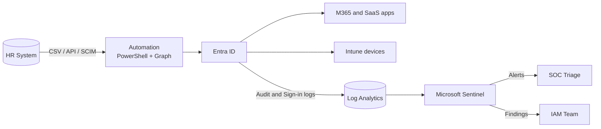
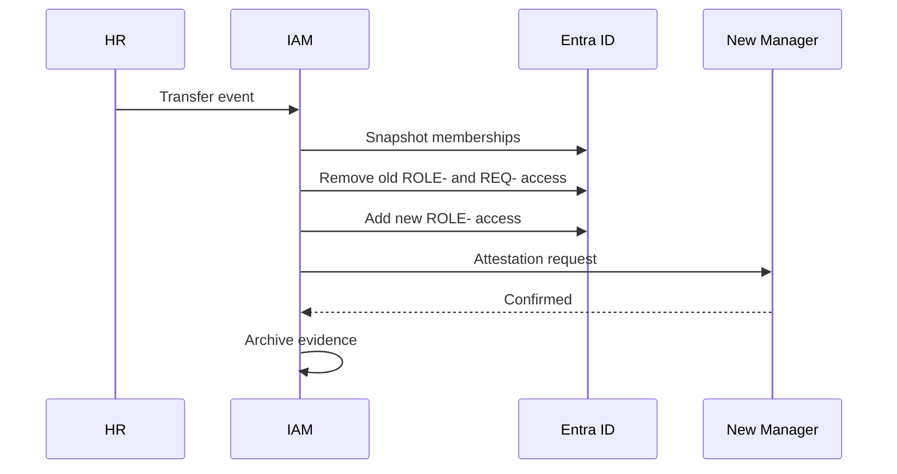
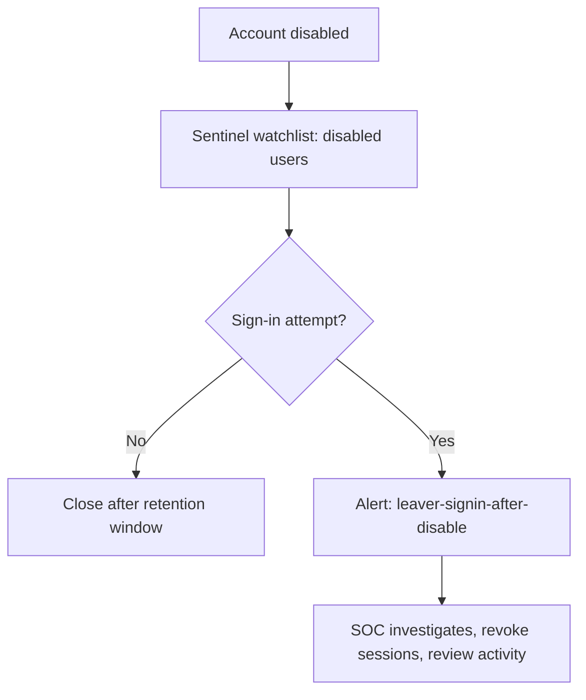

# JML Diagrams

## Architecture

```mermaid
flowchart LR
    HR[(HR System)] -->|CSV / API / SCIM| AUTO[Automation<br/>PowerShell + Graph]
    AUTO --> ENTRA[Entra ID]
    ENTRA --> M365[M365 and SaaS apps]
    ENTRA --> INTUNE[Intune devices]
    ENTRA -->|Audit and Sign-in logs| LA[(Log Analytics)]
    LA --> SENT[Microsoft Sentinel]
    SENT -->|Alerts| SOC[SOC Triage]
    SENT -->|Findings| IAM[IAM Team]
```

## Mover: remove-then-add

```mermaid
sequenceDiagram
    participant HR
    participant IAM
    participant IdP as Entra ID
    participant Mgr as New Manager
    HR->>IAM: Transfer event
    IAM->>IdP: Snapshot memberships
    IAM->>IdP: Remove old ROLE- and REQ- access
    IAM->>IdP: Add new ROLE- access
    IAM->>Mgr: Attestation request
    Mgr-->>IAM: Confirmed
    IAM->>IAM: Archive evidence
```

## Leaver: detection feedback loop

```mermaid
flowchart TD
    A[Account disabled] --> B[Sentinel watchlist: disabled users]
    B --> C{Sign-in attempt?}
    C -->|No| D[Close after retention window]
    C -->|Yes| E[Alert: leaver-signin-after-disable]
    E --> F[SOC investigates, revoke sessions, review activity]
```
